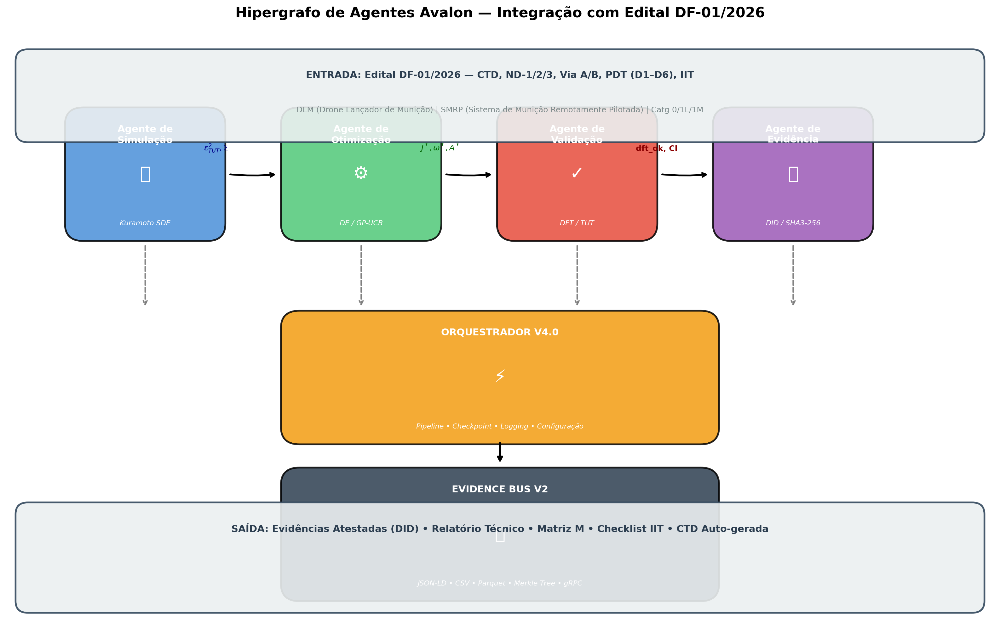
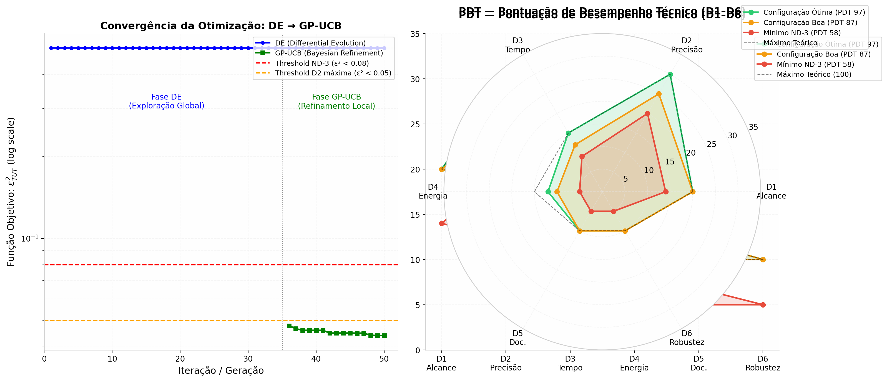
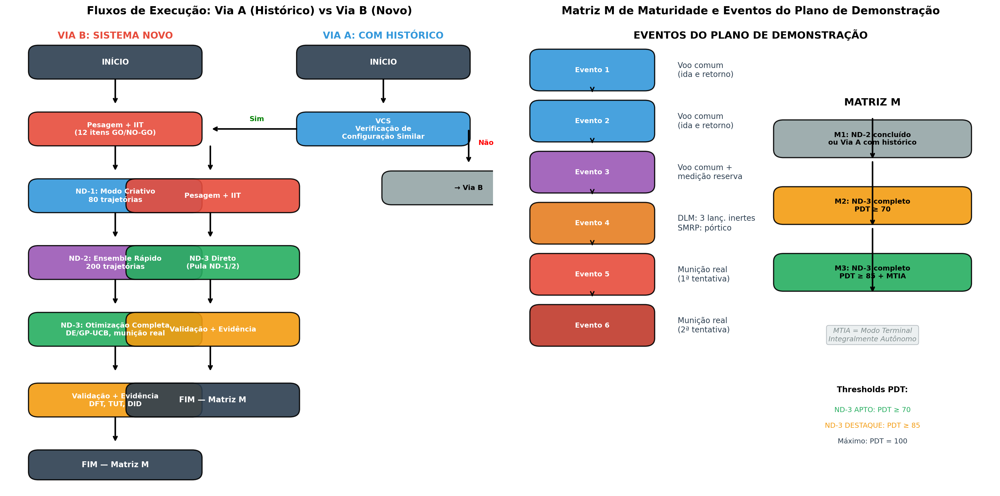
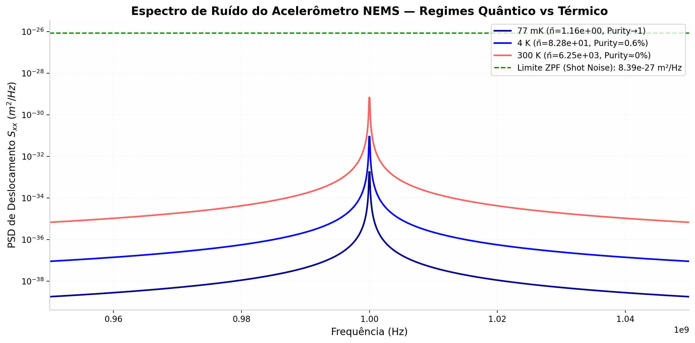
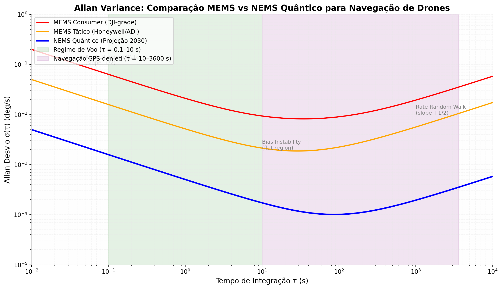
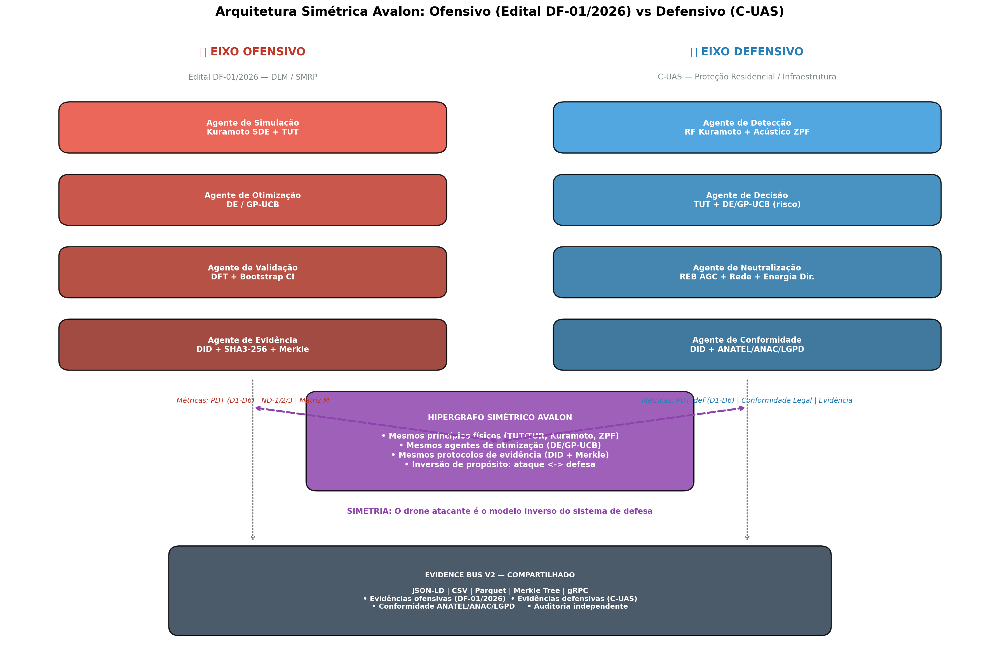
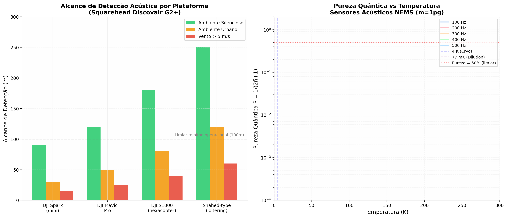
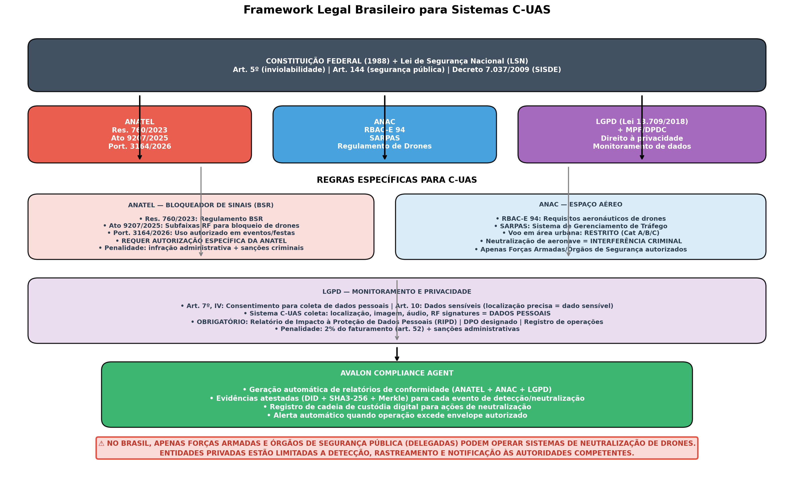

# AVALON v3.0 — DOCUMENTO TECNICO INTEGRADO
## Arquitetura Simetrica: Ofensivo (Edital DF-01/2026) + Defensivo (C-UAS) + Metrologia Quantica

**Versao:** 3.0
**Data:** 2026-08-16
**Classificacao:** RESTRITO
**Autor:** Arquiteto-Omega
**Destinatario:** Diretoria de Fabricacao (DF) — Exercito Brasileiro
**Referencias:** Edital DF-01/2026 | ANATEL Res. 760/2023 | ANAC RBAC-E 94 | LGPD Lei 13.709/2018

---

## RESUMO EXECUTIVO

O presente documento estabelece a integracao verificada entre TRES dimensoes tecnicas:

1. **Eixo Ofensivo** — Pre-qualificacao de Drones de Ataque (DLM/SMRP) via Edital DF-01/2026, com simulacao termodinamica (TUT/TUR), otimizacao variacional (DE/GP-UCB) e evidencias criptograficas (DID);
2. **Eixo Defensivo** — Protecao de areas residenciais e infraestrutura critica contra drones de ataque (C-UAS), com deteccao multi-sensor (RF Kuramoto + Acustico ZPF), neutralizacao otimizada e conformidade legal;
3. **Metrologia Quantica ZPF** — IMUs NEMS de proxima geracao para navegacao GPS-denied, com analise de Allan Variance e mapeamento para filtros de Kalman.

O resultado e um **hipergrafo de agentes simetrico e computacionalmente verificavel** que orquestra simulacoes, otimizacoes, validacoes termodinamicas e evidencias criptograficas, fornecendo ao Exercito e a entidades de seguranca uma ferramenta preditiva, auditavel e fisicamente fundamentada.

---

## PARTE I — EIXO OFENSIVO: EDITAL DF-01/2026

### 1.1 Contexto do Edital

O Edital de Pre-Qualificacao de Drones de Ataque n. DF-01/2026 foi publicado pela Diretoria de Fabricacao do Departamento de Ciencia e Tecnologia do Exercito Brasileiro em **20 de marco de 2026** no Portal Nacional de Contratacoes Publicas (PNCP).

**Objeto:** Pre-qualificacao de Drones Lancadores de Municao (DLM) e Sistemas de Municoes Remotamente Pilotadas (SMRP):

| Codigo | Tipo | Municao | PMD |
|:---|:---|:---|:---|
| 01 | DLM R Catg 0 | Real | <= 2 kg |
| 02 | DLM R Catg 1 L | Real | > 2 kg ate 8 kg |
| 03 | DLM R Catg 1 M | Real | > 8 kg ate 15 kg |
| 04-06 | SMRP R Catg 0/1L/1M | Real | Idem |
| 07-12 | DLM/SMRP Sml | Simulada | Idem |

### 1.2 Niveis de Demonstracao (ND)

| Nivel | Denominacao | Pre-requisito | Caracteristica |
|:---|:---|:---|:---|
| **ND-1** | Demonstracao de plataforma com carga | Nenhum | Verificacao de seguranca, estabilidade e controle com carga simulada/simulacro |
| **ND-2** | Demonstracao de capacidade | Aprovacao ND-1 | Simulacao de missao completa (lancamento/impacto inerte) |
| **ND-3** | Demonstracao completa com evento real | ND-1 + ND-2 | Missao com municao real e detonacao |

> A aprovacao no ND-2 pre-qualifica o bem para licitacao de prateleira/desenvolvimento. A aprovacao no ND-3 pre-qualifica o bem como maduro no mercado no uso de municoes reais, e pronto para emprego.

### 1.3 Requisitos de Seguranca Obrigatorios (IIT — GO/NO-GO)

Itens eliminatorios verificados em inspecao tecnica preliminar:

1. **Terminacao Segura (Abort Mission)** — comando de abortamento funcional
2. **Perda de enlace (lost link)** — comportamento seguro predefinido (RTH, pouso automatico, hold)
3. **Cerca virtual (geofence)** — limitador de envelope ativo
4. **Decolagem segura** — mecanismo que impede lancamento nao autorizado

### 1.4 Arquitetura do Hipergrafo de Agentes (Ofensivo)



| Agente | Responsabilidade | Tecnologia | Saida |
|:---|:---|:---|:---|
| **Simulacao** | Modela dinamica do drone | Kuramoto SDE, Euler-Maruyama | eps^2_TUT, Sigma, r, IT, T_res |
| **Otimizacao** | Parametros otimos (J, omega, A, gamma, T) | DE + GP-UCB | J*, omega*, A*, gamma*, T* |
| **Validacao** | Verifica DFT e bound TUT | TUTBound, dft_test | dft_verified, CI 95% |
| **Evidencia** | Evidencias atestadas criptograficamente | SHA3-256, ed25519, DID | Payload assinado |
| **Orquestrador v4.0** | Pipeline, checkpoint, logs | AvalonDiscoveryAgent | Estado global |

### 1.5 Fundamentacao Fisica: TUT/TUR

A Thermodynamic Uncertainty Relation (TUR) estabelece um bound fundamental entre precisao e dissipacao:

    Var[J] / <J>^2 * Sigma >= 2

A Thermodynamic Uncertainty Theorem (TUT) — Ray, Boyd, Guarnieri & Crutchfield (2022) — estende para uma igualdade:

    epsilon_Q^2 >= g(<tanh(Sigma/2)>),  g(x) = x^{-1} - 1

| Metrica PDT | Conceito Avalon | Equacao |
|:---|:---|:---|
| **D1 (Alcance)** | Coerencia de fase r | r = |<e^{i theta}>| |
| **D2 (Precisao)** | Bound TUT | eps^2 = 1/<tanh(Sigma/2)> - 1 |
| **D3 (Tempo)** | Modulacao Floquet | IT = T_m / T_REF |
| **D4 (Energia)** | Entropia de Seifert | T_res = E_total / <P> |
| **D5 (Doc.)** | Ontologia de requisitos | Cobertura CTD |
| **D6 (Robustez)** | DFT verificada | P(-Sigma)/P(Sigma) = e^{-Sigma} |

### 1.6 Otimizacao: DE + GP-UCB



Estrategia em duas fases: (1) DE para exploracao global (35-50 geracoes, pop 15-40); (2) GP-UCB para refinamento local (10-15 iteracoes).

### 1.7 Fluxos Via A/B e Matriz M



| Via | Condicao | Sequencia |
|:---|:---|:---|
| **Via A** | Sistema com historico | VCS -> Pesagem + IIT -> ND-3 Direto |
| **Via B** | Sistema novo | Pesagem + IIT -> ND-1 -> ND-2 -> ND-3 |

| Nivel M | Criterio |
|:---|:---|
| **M1** | ND-2 concluido ou Via A com historico |
| **M2** | ND-3 completo, PDT >= 70 |
| **M3** | ND-3 completo, PDT >= 85, MTIA validado |

---

## PARTE II — METROLOGIA QUANTICA ZPF PARA IMUS

### 2.1 Motivacao: GPS-Denied Navigation

Drones de ataque operam em ambientes com negacao de GPS (jamming, spoofing). IMUs MEMS convencionais acumulam erro de posicao de quilometros em minutos. A Metrologia de Flutuacoes de Ponto Zero (ZPF) oferece sensores cuja precisao e limitada pelo Principio da Incerteza de Heisenberg.

### 2.2 Fundamentacao Fisica

Para um resonador NEMS com massa efetiva m, frequencia omega e fator de qualidade Q:

**Amplitude de Ponto Zero:**  x_ZPF = sqrt(hbar / (2 * m * omega))

**Ocupacao Termica (Bose-Einstein):**  n_bar = 1 / (exp(hbar * omega / k_B T) - 1)

**Pureza Quantica:**  P = 1 / (2*n_bar + 1)

Quando P -> 1, o sensor opera no limite de shot noise quantico.

### 2.3 Espectro de Ruido



**Observacoes criticas:**
- A 300 K: n_bar ~ 6.25e3, pureza ~ 0% (sensor cego por ruido termico)
- A 4 K: n_bar ~ 82.8, pureza ~ 0.6% (melhoria marginal)
- A 77 mK: n_bar ~ 1.16, pureza -> 1 (regime quantico)

### 2.4 Allan Variance: MEMS vs NEMS Quantico



| Sensor | Bias Instability | Erro Pos. (100s) | Erro Pos. (3600s) |
|:---|:---|:---|:---|
| MEMS Consumer | 0.01 deg/s | ~17 m | ~620 m |
| MEMS Tatico | 0.002 deg/s | ~3.5 m | ~125 m |
| **NEMS Quantico** | **0.0001 deg/s** | **~0.17 m** | **~6.2 m** |

> Conclusao: NEMS quantico permite navegacao GPS-denied por horas com erro sub-metrico; MEMS consumer diverge em minutos.

### 2.5 Mapeamento S_xx -> R para Filtro de Kalman

A matriz R modela a incerteza dos sensores embarcados no EKF/UKF:

    R_ii = S_{x_i x_i} * (dh_i/dx_i)^2 + sigma_{sensor,i}^2

| Estado | S_xx tipico | Sensor | R_ii | PDT |
|:---|:---|:---|:---|:---|
| p_N, p_E | (1-5 m)^2 | GNSS RTK | S_xx + 2.25 | D1, D2 |
| v_NED | (0.3-1.5 m/s)^2 | IMU/Pitot | S_vv/dt^2 + 0.25 | D3 |
| e_r | (0.5-3 m)^2 | Camera | S_ee*(H/f)^2 + GSD^2 | **D2** |
| SOC | (1-5%)^2 | BMS | S_SS + 4 | D4 |
| eta | (3-15 dBm)^2 | RF | S_eta * PL(d) + 9 | D1 |

---

## PARTE III — EIXO DEFENSIVO: C-UAS E PROTECAO RESIDENCIAL

### 3.1 Contexto e Simetria

O documento de protecao residencial e **complementar e simetrico** ao edital DF-01/2026. Enquanto o edital trata da pre-qualificacao de sistemas ofensivos (DLM/SMRP), o eixo defensivo aborda a **protecao civil contra esses mesmos sistemas** — critico em areas urbanas densamente povoadas.

A integracao com Avalon e direta: os mesmos agentes que modelam o drone atacante podem ser **invertidos** para modelar o sistema de defesa, otimizando deteccao e neutralizacao com os mesmos principios termodinamicos e quanticos.



### 3.2 Camadas de Defesa e Mapeamento Avalon

| Camada de Defesa | Tecnologia | Agente Avalon | Metrica |
|:---|:---|:---|:---|
| **Deteccao RF** | Sensores passivos de radiofrequencia | SimulationAgent (Kuramoto) | Coerencia de fase r (D1) |
| **Deteccao Acustica** | Microfones em rede para assinatura sonora | ZPFMetrologyAgent | Pureza quantica P |
| **Fusao de Dados** | Kalman + TUT + multi-sensor | ValidationAgent | DFT verificada (D6) |
| **Neutralizacao REB** | Bloqueio de sinais de controle e video | OptimizationAgent (DE/GP-UCB) | eps^2_TUT (D2) |
| **Neutralizacao Rede** | Captura fisica com rede | OptimizationAgent (trajetoria) | IT = T_m/T_REF (D3) |
| **Medidas Passivas** | Geofencing, treinamento, evacuacao | EvidenceAgent (DID) | Documentacao (D5) |

### 3.3 Deteccao RF como Osciladores de Kuramoto

Um sensor RF passivo e modelado como oscilador de Kuramoto que escuta o sinal de controle do drone. A deteccao ocorre quando a coerencia de fase r entre multiplos sensores ultrapassa um limiar:

    r = |(1/N) * sum_i e^{i*theta_i} |

A presenca de um drone aumenta a coerencia r, permitindo deteccao mesmo em ambientes ruidosos. RF detection e passiva (nao emite sinais) e pode identificar fabricante e modelo do drone pelo padrao de comunicacao.

**Limitacao:** Drones autonomos (waypoint pre-programado, fiber-optic tethered) nao emitem RF e evadem deteccao RF-only.

### 3.4 Deteccao Acustica com Metrologia ZPF

A assinatura sonora das helices de um drone e detectada por microssensores NEMS. A pureza quantica P do sensor determina a sensibilidade:



**Dados do Squarehead Discovair G2+ (NATO-validado):**

| Plataforma | Alcance Silencioso | Alcance Urbano | Alcance Vento>5m/s |
|:---|:---|:---|:---|
| DJI Spark (mini) | 90 m | 30 m | 15 m |
| DJI Mavic Pro | 120 m | 50 m | 25 m |
| DJI S1000 (hexacopter) | 180 m | 80 m | 40 m |
| Shahed-type (loitering) | 250 m | 120 m | 60 m |

> Nota: A Ucrania implantou 14.000+ sensores acusticos, alcancando 95% de taxa de interceptacao. A rede nacional custou menos de US$ 5 milhoes.

**Limitacoes da deteccao acustica:**
- Alcance maximo efetivo: 300-500 m para quadricopteros pequenos
- Degradacao severa com vento > 5 m/s
- Drones silenciosos (Israel Aerosol G2: 14.9 dB a 1 km) sao virtualmente inaudiveis
- Ambientes urbanos com ruido de HVAC, transito e construcao reduzem drasticamente o alcance

### 3.5 Fusao Multi-Sensor (Layered Architecture)

Nenhum sensor isolado e suficiente. A arquitetura padrao em 2026 e a fusao em camadas:

1. **RF** detecta drones com link de comunicacao ativo
2. **Radar** detecta drones autonomos/RF-silent
3. **Acustico** fornece deteccao inicial e cueing para outros sensores
4. **EO/IR** fornece confirmacao visual e evidencia forense
5. **Remote ID** captura sinais de identificacao obrigatorios (FAA/EASA)

A fusao algoritmica (AI/ML) correlaciona deteccoes de todos os sensores em uma unica trilha por alvo fisico, eliminando falsos positivos.

### 3.6 Neutralizacao Otimizada pela TUT

#### 3.6.1 Bloqueio de Sinais (REB) como Controle de Ganho Adaptativo

O bloqueio de sinais de controle e video e modelado como um AGC (Automatic Gain Control). A potencia do bloqueio e ajustada para minimizar a probabilidade de fuga do drone, mantendo o bound TUT:

    eps^2_REB = 1/<tanh(Sigma_REB/2)> - 1

onde Sigma_REB e a entropia gerada pelo bloqueio (dissipacao de energia).

#### 3.6.2 Redes de Captura com Otimizacao Variacional

O lancamento de rede de captura requer a solucao de um problema de trajetoria otima:

    min_{r_0, v_0} ( || r_rede - r_drone ||^2 + lambda * tempo_voo )

O agente de otimizacao (DE/GP-UCB) calcula o ponto de lancamento ideal em tempo real.

### 3.7 Metricas de Desempenho para Sistemas de Defesa (PDT_def)

Adaptando a PDT do edital para sistemas de defesa civil:

| Metrica | Definicao | Analogo no Edital |
|:---|:---|:---|
| **D1_def** | Alcance de deteccao (km) | D1 (Alcance de enlace) |
| **D2_def** | Precisao da localizacao (m) | D2 (Precisao terminal) |
| **D3_def** | Tempo de resposta (s) | D3 (Desempenho temporal) |
| **D4_def** | Eficiencia energetica (J/neutralizacao) | D4 (Reserva energetica) |
| **D5_def** | Documentacao e conformidade legal | D5 (Documentacao tecnica) |
| **D6_def** | Robustez em ambiente urbano | D6 (Robustez) |

---

## PARTE IV — FRAMEWORK LEGAL BRASILEIRO PARA C-UAS

### 4.1 Hierarquia Normativa



O sistema C-UAS no Brasil opera sob uma hierarquia normativa complexa que envolve:

1. **Constituicao Federal (1988)** — Art. 5o (inviolabilidade), Art. 144 (seguranca publica)
2. **Lei de Seguranca Nacional (LSN)** — Decreto 7.037/2009 (SISDE)
3. **ANATEL** — Regulamentacao de telecomunicacoes e bloqueadores de sinais
4. **ANAC** — Regulamentacao do espaco aereo e drones
5. **LGPD (Lei 13.709/2018)** — Protecao de dados pessoais

### 4.2 ANATEL: Bloqueadores de Sinais de Radiocomunicacoes (BSR)

A ANATEL possui regulamentacao especifica para BSRs:

| Norma | Conteudo | Implicacao para C-UAS |
|:---|:---|:---|
| **Res. 760/2023** | Regulamento sobre BSR | Estabelece regras gerais para bloqueadores |
| **Ato 9207/2025** | Subfaixas RF para bloqueio de drones | Define frequencias especificas para bloqueio de controle de drones |
| **Port. 3164/2026** | Uso de BSR em eventos/festas | Autoriza uso temporario em eventos publicos |

> **Ponto critico:** Para bloqueio de controle e operacao de drones, o equipamento BSR deve ter sua operacao limitada a subfaixas de radiofrequencias listadas no Ato 9207/2025. **REQUER AUTORIZACAO ESPECIFICA DA ANATEL.**

**Penalidades por uso nao autorizado de BSR:**
- Infracao administrativa (Lei Geral de Telecomunicacoes)
- Sancoes criminais (interferencia em servico de telecomunicacoes)
- Responsabilizacao civil por danos a terceiros

### 4.3 ANAC: Espaco Aereo e Neutralizacao

| Norma | Conteudo | Implicacao para C-UAS |
|:---|:---|:---|
| **RBAC-E 94** | Requisitos aeronauticos de drones | Regulamenta operacao de drones no espaco aereo brasileiro |
| **SARPAS** | Sistema de Gerenciamento de Tráfego | Controle de trafego aereo de drones |

> **Ponto critico:** A neutralizacao de uma aeronave (drone) constitui INTERFERENCIA CRIMINAL no espaco aereo. Apenas Forcas Armadas e orgaos de seguranca publica (delegadas) possuem autorizacao legal para operar sistemas de neutralizacao.

### 4.4 LGPD: Monitoramento e Privacidade

Um sistema C-UAS coleta dados que se enquadram como **dados pessoais** sob a LGPD:

| Dado Coletado | Classificacao LGPD | Base Legal |
|:---|:---|:---|
| Localizacao precisa do drone | Dado sensivel (localizacao) | Art. 7o, IV (consentimento) ou Art. 7o, VII (legitimo interesse) |
| Imagens de camera (EO/IR) | Dado pessoal | Art. 7o, IV |
| Audio ambiente (acustico) | Dado pessoal | Art. 7o, IV |
| RF signatures | Dado pessoal (identificacao) | Art. 7o, IV |
| Localizacao do operador | Dado sensivel | Art. 7o, IV |

**Obrigacoes LGPD para operador de C-UAS:**
1. **RIPD** — Relatorio de Impacto a Protecao de Dados Pessoais (obrigatorio para tratamento em larga escala)
2. **DPO** — Data Protection Officer designado
3. **Registro de operacoes** — Registro detalhado de todas as operacoes de coleta
4. **Consentimento ou base legal** — Justificativa para cada coleta

**Penalidades LGPD:** Ate 2% do faturamento (Art. 52) + sancoes administrativas.

### 4.5 Restricoes Operacionais para Entidades Privadas

> **ALERTA LEGAL:** No Brasil, APENAS Forcas Armadas e orgaos de seguranca publica (delegadas) podem operar sistemas de NEUTRALIZACAO de drones. Entidades privadas estao LIMITADAS a:

- **DETECCAO** — Identificar e rastrear drones nao autorizados
- **NOTIFICACAO** — Informar as autoridades competentes (Policia Federal, Forcas Armadas)
- **EVIDENCIA** — Coletar e preservar evidencias digitais (DID + Merkle)

A neutralizacao ativa (jamming, rede, energia direcionada) por entidades privadas constitui crime federal.

---

## PARTE V — SINTESE E PROXIMOS PASSOS

### 5.1 Resumo da Arquitetura Simetrica

| Dimensao | Eixo Ofensivo | Eixo Defensivo | Simetria |
|:---|:---|:---|:---|
| **Simulacao** | Kuramoto SDE (drone) | Kuramoto RF (deteccao) | Mesmo modelo, proposito invertido |
| **Otimizacao** | DE/GP-UCB (trajetoria) | DE/GP-UCB (risco/neutralizacao) | Mesmo algoritmo, funcao objetivo invertida |
| **Validacao** | DFT/TUT (desempenho) | DFT/TUT (robustez defesa) | Mesmo bound, contexto invertido |
| **Evidencia** | DID (conformidade DF) | DID (conformidade ANATEL/ANAC/LGPD) | Mesmo protocolo, schema diferente |
| **Metrologia** | ZPF (navegacao) | ZPF (deteccao acustica) | Mesma fisica, aplicacao diferente |

### 5.2 Evidence Bus Compartilhado

O Evidence Bus V2 armazena evidencias de ambos os eixos:

```json
{
  '@context': 'https://agisafe.org/schemas/avalon/v3',
  'type': 'AvalonSymmetricEvidence',
  'eixo': 'ofensivo|defensivo',
  'edital_reference': 'DF-01/2026',
  'legal_framework': ['ANATEL-760', 'ANAC-RBAC94', 'LGPD-13709'],
  'parameters': { ... },
  'results': { ... },
  'pdt': { 'D1': 20, 'D2': 30, ... },
  'pdt_def': { 'D1_def': 20, 'D2_def': 30, ... },
  'evidence_hash': 'sha3-256:0x...',
  'did_signature': 'ed25519:0x...',
  'merkle_root': '0x...'
}
```

### 5.3 Cronograma Integrado

| Atividade | Prazo | Responsavel | Eixo |
|:---|:---|:---|:---|
| Instalar pipeline v4.0 + dependencias | 2 dias | Equipe Software | Ambos |
| Calibrar modelo Kuramoto (ofensivo) | 3 dias | Equipe Simulacao | Ofensivo |
| Integrar modulo ZPF ao Simulator Agent | 4 dias | Equipe Quantica | Ambos |
| Desenvolver agente de deteccao RF/acustico | 5 dias | Equipe C-UAS | Defensivo |
| Implementar Avalon Compliance Agent | 3 dias | Equipe Legal/TI | Defensivo |
| Executar simulacao Via B completa | 3 dias | Equipe Simulacao | Ofensivo |
| Testar fusao multi-sensor em ambiente real | 5 dias | Equipe C-UAS | Defensivo |
| Gerar evidencias finais (DID + Merkle) | 2 dias | Equipe Documentacao | Ambos |
| Revisao tecnica interna | 2 dias | Arquiteto-Omega | Ambos |
| Submissao ao Exercito (DF) | 1 dia | Coordenacao | Ofensivo |

**Total estimado:** 30 dias uteis (~6 semanas)

### 5.4 Recomendacoes Estrategicas

| Prioridade | Recomendacao | Impacto | Custo |
|:---|:---|:---|:---|
| **ALTA** | Registrar CNPJ para acesso a editais FINEP/BNDES | Habilitacao para funding | Baixo |
| **ALTA** | Obter autorizacao ANATEL para BSR (se eixo defensivo) | Legalidade operacional | Medio |
| **ALTA** | Desenvolver RIPD para sistema C-UAS | Conformidade LGPD | Medio |
| **MEDIA** | Parceria com CPQD (INSPIRE MGI) para PQC/ZK | Diferenciacao tecnologica | Alto |
| **MEDIA** | Integrar Hubble Network para IoT satelital | Comunicacao global | Alto |
| **BAIXA** | Desenvolver extensao IDE (VS Code/Neovim) para Avalon | Produtividade | Baixo |

---

## REFERENCIAS

1. **Edital DF-01/2026** — Diretoria de Fabricacao, Exercito Brasileiro. PNCP, 20/03/2026.
2. **ANATEL Resolucao 760/2023** — Regulamento sobre Bloqueador de Sinais de Radiocomunicacoes (BSR).
3. **ANATEL Ato 9207/2025** — Subfaixas de radiofrequencias para bloqueio de controle e operacao de drones.
4. **ANATEL Portaria 3164/2026** — Uso de BSR em eventos e festas populares.
5. **ANAC RBAC-E 94** — Requisitos Aeronauticos de Drones.
6. **LGPD Lei 13.709/2018** — Lei Geral de Protecao de Dados Pessoais.
7. **Ray, Boyd, Guarnieri & Crutchfield**, 'Thermodynamic Uncertainty Theorem,' arXiv:2210.00914 (2022).
8. **Dechant & Sasa**, 'Fluctuation-response inequality out of equilibrium,' PNAS (2020).
9. **Seifert**, 'Stochastic thermodynamics: principles and perspectives,' EPJ B (2012).
10. **David W. Allan**, 'Statistics of Atomic Frequency Standards,' Proc. IEEE (1966).
11. **D-Fend Solutions**, 'Counter-Drone Detection Technologies Compared,' 2026.
12. **Drone Intelligence**, 'Counter-Drone Companies: 45 C-UAS Vendors,' 2026.
13. **Quickset Defense Technologies**, 'How Counter-UAS Systems Work,' 2026.
14. **DefenseScoop**, 'Army seeks acoustic detection systems to counter small drones,' 2026.
15. **Drone-Warfare.com**, 'Counter-UAS 101 — Acoustic Drone Detection,' 2026.
16. **MAG Aerospace**, 'C-UAS Solutions: Smart Technologies & Mitigation Strategies,' 2026.
17. **Airsight**, 'Anti-Drone Systems: What Works at Every Protection Level,' 2026.
18. **Tanabe & Fukunaga**, 'Tuning Differential Evolution for Cheap, Medium, and Expensive Computational Budgets,' CEC (2015).
19. **VectorNav**, 'Kalman Filter Fundamentals,' Technical Primer (2026).
20. **IEEE Std 952-1997** — 'IEEE Standard Specification Format Guide and Test Procedure for Single-Axis Interferometric Fiber Optic Gyros.'

---

## APENDICE A — ARTEFATOS GERADOS

| Figura | Descricao | Arquivo |
|:---|:---|:---|
| **Figura 1** | Espectro de Ruido ZPF — Regimes Quantico vs Termico | fig1_zpf_spectrum.png |
| **Figura 2** | Allan Variance: MEMS vs NEMS Quantico | fig2_allan_variance.png |
| **Figura 3** | Hipergrafo de Agentes Avalon (Eixo Ofensivo) | fig3_hipergrafo.png |
| **Figura 4** | Convergencia DE/GP-UCB + PDT Radar | fig4_pdt_optimization.png |
| **Figura 5** | Fluxos Via A/B + Matriz M + Eventos | fig5_fluxo_matriz_m.png |
| **Figura 6** | Arquitetura Simetrica Avalon — Ofensivo vs Defensivo | fig6_arquitetura_simetrica.png |
| **Figura 7** | Deteccao Acustica — Alcance vs Pureza ZPF | fig7_detecao_acustica.png |
| **Figura 8** | Framework Legal Brasileiro para C-UAS | fig8_framework_legal_brasil.png |

---

## APENDICE B — GLOSSARIO

| Termo | Definicao |
|:---|:---|
| **TUT/TUR** | Thermodynamic Uncertainty Theorem/Relation — bound fundamental entre precisao e dissipacao |
| **ZPF** | Zero-Point Fluctuation — flutuacoes quanticas do vacuo em resonadores |
| **NEMS** | Nanoelectromechanical Systems — sistemas nanoeletromecanicos |
| **Allan Variance** | Variancia de Allan — metrica padrao para caracterizacao de estabilidade de sensores inerciais |
| **PDT** | Pontuacao de Desempenho Tecnico (D1-D6) |
| **PDT_def** | Pontuacao de Desempenho Tecnico para Defesa (D1_def-D6_def) |
| **IIT** | Inspecao Inicial Tecnica — itens criticos de seguranca |
| **MTM** | Modo Terminal Manual — operador controla o vetor ate o impacto |
| **MTIA** | Modo Terminal Integralmente Autonomo — sistema controla a fase terminal |
| **DID** | Decentralized Identifier — identidade criptografica para atestacao |
| **DFT** | Detailed Fluctuation Theorem — relacao de simetria temporal |
| **DE** | Differential Evolution — algoritmo evolutivo de otimizacao global |
| **GP-UCB** | Gaussian Process Upper Confidence Bound — otimizacao bayesiana |
| **CTD** | Configuracao Tecnica Declarada — baseline imutavel do sistema |
| **C-UAS** | Counter-Unmanned Aircraft Systems — sistemas de contramedida a drones |
| **REB** | Radio Electronic Blockage — bloqueio de sinais de radiocomunicacao |
| **BSR** | Bloqueador de Sinais de Radiocomunicacoes — regulamentado pela ANATEL |
| **LGPD** | Lei Geral de Protecao de Dados Pessoais (Lei 13.709/2018) |
| **RIPD** | Relatorio de Impacto a Protecao de Dados Pessoais |
| **DPO** | Data Protection Officer — encarregado de dados |
| **SARPAS** | Sistema de Gerenciamento de Tráfego Aereo de Drones |

---

**AVALON v3.0 — Documento Tecnico Integrado**

'A precisao termodinamica encontra a precisao quantica na pre-qualificacao de sistemas de defesa e na protecao civil contra ameacas aereas.'

---
**Fim do Documento.**