# SISBIN — Tríade Técnica: Arquitetura PDF-SISBIN | Integração Safe-Core | Mitigação Multi-Cloud Soberano

> **Versão:** 1.0  
> **Data:** 2026-08-12  
> **Classificação:** Documento técnico de referência  
> **Selo:** SISBIN-TRIADE-TECNICA-v1.0-2026-08-12

---

## Sumário Executivo

Este documento consolida três entregas técnicas solicitadas para o Sistema Brasileiro de Inteligência (SISBIN):

1. **Arquitetura de Referência Técnica Detalhada (PDF-SISBIN)** — Diagrama C4, stack validada e threat model STRIDE para a Plataforma de Dados Federada.
2. **Documento de Integração SISBIN ↔ Safe-Core** — Mapeamento das propostas SISBIN (MAIA, NSI, API Gateway) aos padrões Safe-Core (Evidence Bus, Anti-Vibe, Polyglot Verification).
3. **Análise de Risco da Concentração Serpro + Proposta de Mitigação Multi-Cloud Soberano** — Avaliação crítica da dependência da Nuvem de Governo e arquitetura de resiliência distribuída.

> **Base factual:** Dados oficiais do gov.br, ABIN, MGI, Serpro, Dataprev, CEPESC/CISSA, Decreto 11.693/2023, Portaria 2.091/2024, PTD/ABIN-MGI (mar/2024), Nuvem de Governo (jun/2025).

---

# PARTE I — Arquitetura de Referência Técnica: PDF-SISBIN

## 1. Visão de Contexto (C4 — Nível 1)

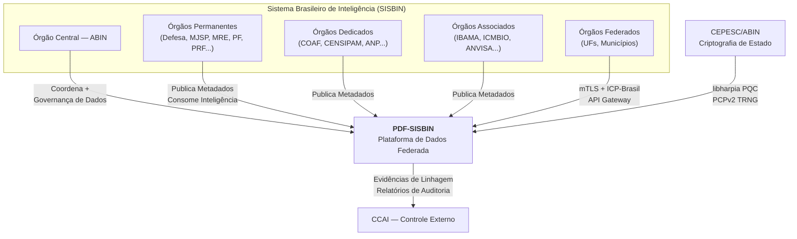

### 1.1 Atores e Responsabilidades

| Ator | Papel no PDF-SISBIN | Classificação Máxima |
|------|---------------------|----------------------|
| ABIN (Órgão Central) | Governança de catálogo, políticas ABAC, auditoria CCAI | Ultrassecreto |
| Órgãos Permanentes | Produtores/consumores de dados; mantêm soberania sobre ativos | Secreto/Ultrassecreto |
| Órgãos Dedicados | Produtores especializados (COAF → ilícitos financeiros) | Reservado/Sigiloso |
| Órgãos Associados | Consumidores pontuais; metadados limitados | Sigiloso |
| Órgãos Federados (UFs) | Ingestão via API Gateway; escopo restrito por câmara | Sigiloso |
| CCAI | Receptor de evidências de linhagem e relatórios de conformidade | — |
| CEPESC/ABIN | Provedor de criptografia PQC híbrida (libharpia) e TRNG | — |

---

## 2. Visão de Containers (C4 — Nível 2)

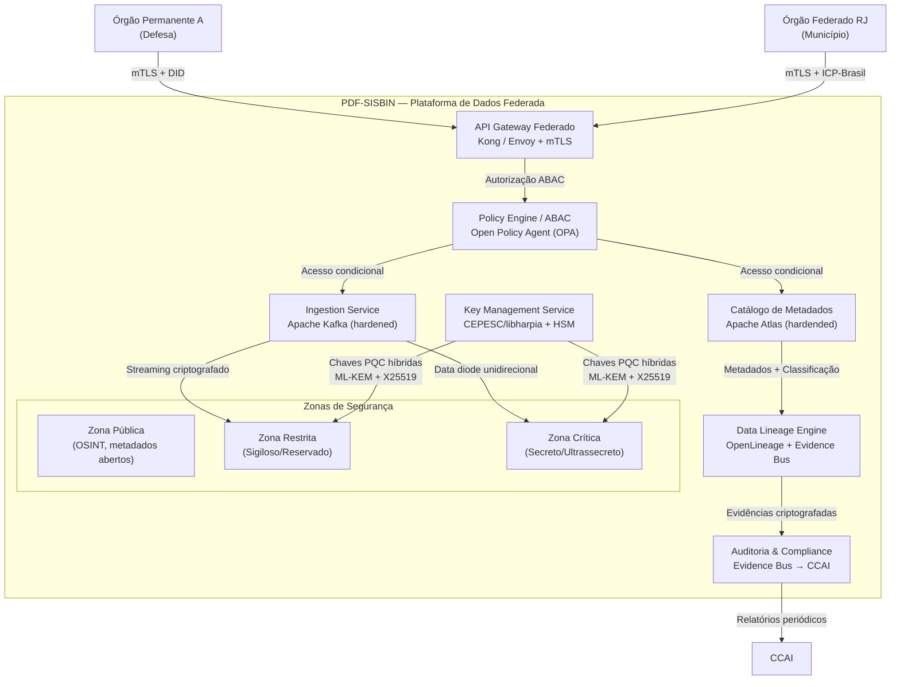

---

## 3. Visão de Componentes (C4 — Nível 3) — Data Lineage & Evidence Bus

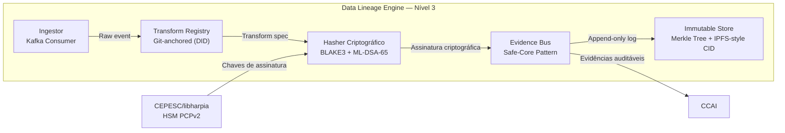

---

## 4. Stack Tecnológica Validada

### 4.1 Camada de Infraestrutura — Nuvem Soberana

| Componente | Tecnologia | Justificativa | Status Real (2026) |
|------------|-----------|---------------|-------------------|
| IaaS Zona Pública | Serpro Cloud / Dataprev Multi-cloud | Soberania operacional; 250+ órgãos já aderiram | ✅ Operacional desde jun/2025 |
| IaaS Zona Restrita | Serpro Cloud + criptografia CEPESC | Dados em solo BR; gestão 100% estatal | ✅ Operacional |
| IaaS Zona Crítica | Datacenter ABIN/CEPESC + air-gap | Air-gap físico para ultrassecreto; data diode para ingestão | 🔄 Em projeto |
| Hardware Security | PCPv2 (TRNG) + HSM Thales/Luna | Geração de chaves em hardware; libharpia para PQC | ✅ PCPv2 operacional; libharpia em desenvolvimento |
| Rede Privativa | RPC-APF (Anatel) + msg.gov | Comunicação segura de Estado; dupla camada de criptografia | ✅ msg.gov em testes/produção |

### 4.2 Camada de Plataforma — PDF-SISBIN

| Componente | Tecnologia | Hardering / Adaptação SISBIN |
|------------|-----------|------------------------------|
| API Gateway | Kong Gateway (OSS) ou Envoy | mTLS obrigatório; DID com capability tokens; rate limiting por câmara temática; integração ICP-Brasil + CEPESC |
| Catálogo de Metadados | Apache Atlas 2.x | Custom type system para classificação SISBIN (sigiloso/reservado/secreto/ultrassecreto); integração com OPA para ABAC; criptografia de metadados sensíveis em repouso (AES-256-GCM + libharpia) |
| Policy Engine (ABAC) | Open Policy Agent (OPA) + Rego | Políticas por atributo: classificação, câmara temática, necessidade de conhecimento, origem do dado, tempo de retenção; fail-closed |
| Streaming | Apache Kafka (KRaft mode) | Criptografia TLS 1.3 + mTLS inter-broker; ACLs por tópico alinhados às câmaras temáticas; retenção criptografada com chaves rotacionadas pelo KMS CEPESC |
| Data Lineage | OpenLineage + Marquez (custom) | Cada transformação gera evidence hash (BLAKE3); assinatura ML-DSA-65 (libharpia); ancoragem em DID do órgão produtor; Merkle tree para integridade do log |
| Evidence Bus | Safe-Core Pattern (custom Rust) | Canal imutável de evidências criptográficas; cada entry = hash + assinatura + timestamp + DID produtor; replicação cross-zone com data diode |
| Banco Catálogo | PostgreSQL 16 + TDE | TDE com chaves do KMS CEPESC; replicação síncrona entre Serpro e Dataprev (multi-cloud); audit logging nativo |
| Object Storage (metadados) | MinIO (S3-compatível) | Criptografia em repouso (SSE-S3 com chaves CEPESC); versioning; WORM para evidências de linhagem |

### 4.3 Camada de Segurança e Criptografia

| Componente | Tecnologia | Especificação |
|------------|-----------|---------------|
| Criptografia em Trânsito | TLS 1.3 + mTLS | Curvas híbridas: X25519 + ML-KEM-768 (libharpia); certificados ICP-Brasil para identidade; DID para capability tokens |
| Criptografia em Repouso | AES-256-GCM + ML-KEM-768 | Chaves gerenciadas pelo KMS CEPESC; envelope encryption; HSM Thales Luna 7 para root keys |
| Assinatura Digital | ML-DSA-65 (híbrida Ed25519) | Conforme FIPS 204 (draft); libharpia implementação brasileira; PCPv2 para geração de chaves |
| Hash Criptográfico | BLAKE3 | Para evidence bus e integridade de linhagem; mais rápido que SHA-3 e resistente a length-extension |
| TRNG | PCPv2 (CEPESC) | Hardware token com gerador de números aleatórios quântico; usado para seed de CSPRNG e geração de chaves |
| Data Diode | Fibra óptica unidirecional + FPGA | Ingestão unidirecional para zona crítica; validação de pacotes com ML-DSA-65 em FPGA antes do diode |

---

## 5. Threat Model — STRIDE

### 5.1 Superfície de Ataque

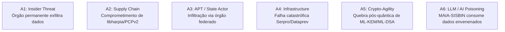

### 5.2 Matriz STRIDE

| Ameaça | Categoria STRIDE | Vetor | Impacto | Mitigação Técnica | Severidade |
|--------|-----------------|-------|---------|-------------------|------------|
| **T1** — Agente interno de órgão permanente acessa dados além de sua "necessidade de conhecimento" | Elevation of Privilege | ABAC mal configurado; escalation via compromised credentials | Vazamento de dados ultrassecretos; crise institucional | OPA fail-closed; DID capability tokens com escopo temporal (≤4h); revisão humana obrigatória para acesso a ultrassecreto; audit trail imutável no Evidence Bus | **Crítica** |
| **T2** — Comprometimento da cadeia de suprimentos do CEPESC (libharpia ou PCPv2) | Tampering | Injeção de backdoor em biblioteca criptográfica; clonagem de TRNG | Colapso de toda a criptografia do SISBIN; dados coletados agora, decifrados depois (Harvest Now, Decrypt Later) | Build reproducível (SLSA L3); assinatura de releases com ML-DSA-65; verificação formal (Kani/Coq) de rotinas críticas; air-gap para compilação de libharpia; dual-control para atualizações | **Crítica** |
| **T3** — APT infiltra via órgão federado (UF/município) com baixa maturidade de segurança | Spoofing + Elevation | Phishing de ponto focal federado; lateral movement para PDF-SISBIN | Acesso a metadados de múltiplas câmaras; mapeamento de capacidades | API Gateway com DID + capability tokens; microsegmentação por câmara temática; honeypots de metadados; anomalia detection no gateway (MAIA-SISBIN integrado) | **Alta** |
| **T4** — Falha catastrófica do datacenter Serpro (incêndio, ataque físico, ransomware) | Denial of Service | Ransomware no hipervisor; falha elétrica; desastre natural | Indisponibilidade do PDF-SISBIN; paralisia do ciclo de inteligência | Multi-cloud ativo-ativo (Serpro + Dataprev + RNP); RPO=0, RTO<15min para zona pública; backup criptografado em site geograficamente distinto; CIOD-SISBIN 24/7 | **Alta** |
| **T5** — Quebra criptoanalítica de ML-KEM-768 ou ML-DSA-65 (avanço quântico ou clássico) | Information Disclosure | Computador quântico ou ataque criptoanalítico clássico inesperado | Retroatividade: todos os dados protegidos por PQC híbrida comprometidos | Crypto-agility: rotacionamento automático de algoritmos; monitoramento de NIST PQC standards; fallback para algoritmos alternativos (FrodoKEM, SPHINCS+); separação de chaves por classificação | **Alta** |
| **T6** — Envenenamento de dados no pipeline OSINT (MAIA-SISBIN) | Tampering + Repudiation | Injeção de fake news/ deepfakes em fontes abertas; LLM fine-tuned com dados envenenados | Produto de inteligência falso; decisões estratégicas erradas; desconfiança no sistema | Polyglot Verification (Safe-Core): verificação cruzada de fontes; Evidence Bus rastreia proveniência de cada dado OSINT; sandbox de IA com guardrails; revisão humana obrigatória para produtos de IA | **Alta** |
| **T7** — Negation de evidências de linhagem (apagar rastros de acesso indevido) | Repudiation | Ataque ao Evidence Bus; corrupção de Merkle tree | Impossibilidade de accountability perante CCAI | Append-only log com replicação multi-site; assinatura criptográfica de cada entry; Merkle root publicado periodicamente em blockchain/ledger público (âncora de tempo) | **Média** |
| **T8** — Escalação de privilégios no PostgreSQL/Kafka via vulnerabilidade CVE | Elevation of Privilege | CVE não patchada; configuração insegura | Acesso total ao catálogo; leitura de metadados classificados | Hardening CIS; patch management automático (janela ≤72h para CVE crítica); scanning contínuo (Trivy/Grype); mínimo privilégio; network policies | **Média** |
| **T9** — Vazamento de metadados via side-channel (timing, cache) | Information Disclosure | Co-localização de workloads; shared CPU cache | Inferência de atividades de inteligência a partir de padrões de acesso | Isolamento de tenants por zona; dedicated cores para zona crítica; constant-time algorithms em libharpia; cache partitioning (Intel CAT) | **Média** |
| **T10** — DDoS no API Gateway via órgão federado comprometido | Denial of Service | Botnet via município infectado; flooding de requisições | Indisponibilidade do gateway; negação de serviço ao SISBIN | Rate limiting por DID; circuit breaker; GeoIP + reputação; scrubbing center (Serpro); challenge-response para órgãos federados | **Baixa** |

---

# PARTE II — Documento de Integração: SISBIN ↔ Safe-Core

## 1. Mapeamento Conceitual

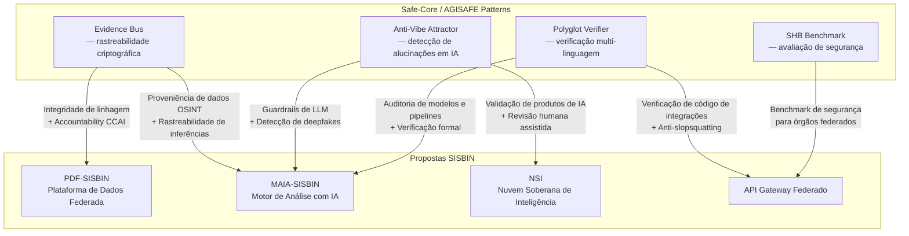

---

## 2. Integração Evidence Bus ↔ PDF-SISBIN

### 2.1 Conceito Safe-Core
O **Evidence Bus** é um canal imutável, criptograficamente verificável, que registra toda a cadeia de transformação de dados — desde a ingestão até o produto de inteligência final. Cada entry contém: hash do estado anterior, hash do conteúdo, assinatura do agente, timestamp, e DID do contexto.

### 2.2 Adaptação para SISBIN

| Camada SISBIN | Ponto de Integração Evidence Bus | Formato da Evidência |
|---------------|----------------------------------|---------------------|
| **Ingestão** (Kafka Consumer) | Cada mensagem ingerida gera evidence: `hash(payload_raw) + DID_órgão + timestamp + classificação` | `EvidenceEntry { prev_hash, content_hash, signer_did, timestamp, classification, signature }` |
| **Transformação** (pipeline de dados) | Cada transformação (ETL, enriquecimento, anonimização) gera evidence com referência à transformação anterior | `TransformEvidence { input_evidence_hash, transform_spec_hash, output_hash, git_commit, signature }` |
| **Catálogo** (Apache Atlas) | Cada alteração de metadados (classificação, owner, schema) gera evidence | `MetadataEvidence { entity_guid, attr_changed, old_val_hash, new_val_hash, actor_did, timestamp }` |
| **Acesso** (OPA decision log) | Cada decisão de autorização ABAC gera evidence | `AccessEvidence { subject_did, resource, action, decision, policy_version, timestamp }` |
| **Compartilhamento** (API Gateway) | Cada compartilhamento entre órgãos gera evidence com escopo e expiração | `ShareEvidence { from_org, to_org, data_ref, scope, expiry, signature }` |

### 2.3 Arquitetura de Implementação

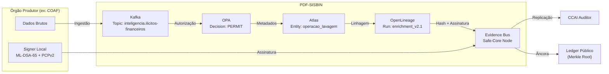

### 2.4 Benefício para CCAI
A CCAI pode, a qualquer momento, solicitar o **Merkle root** do Evidence Bus e verificar criptograficamente que nenhuma evidência foi omitida ou alterada. A prova de inclusão (Merkle proof) permite auditabilidade sem exposição do conteúdo sensível.

---

## 3. Integração Anti-Vibe ↔ MAIA-SISBIN

### 3.1 Conceito Safe-Core
O **Anti-Vibe Attractor** é um sistema de detecção e mitigação de "alucinações" (outputs incorretos, confabulações, ou comportamentos indesejados) em sistemas de IA. Opera em múltiplos níveis: bibliotecas, segurança, memória de contexto, lógica, comportamento do agente, e qualidade de performance.

### 3.2 Adaptação para MAIA-SISBIN

| Categoria Anti-Vibe | Aplicação em MAIA-SISBIN | Mecanismo |
|--------------------|--------------------------|-----------|
| **Library Hallucination** | Modelo cita fonte/documento inexistente | Polyglot Verifier valida existência do documento no catálogo Atlas; cross-reference com repositório Git do órgão produtor |
| **Security Hallucination** | Modelo sugere ameaça sem base factual; ou ignora ameaça real | SHB Benchmark avalia o modelo contra dataset de ameaças conhecidas; red teaming automatizado |
| **Context Memory** | Modelo confunde informações de câmaras temáticas diferentes (ex: mistura dados de terrorismo com ilícitos financeiros) | Compartimentação estrita por câmara no prompt context; sandbox de IA isolado por câmara; Evidence Bus rastreia qual contexto foi usado |
| **Logic/Behavior** | Modelo produz conclusão não suportada pelas premissas (falácia lógica) | Symbolic verifier (Lean/Coq) para validar argumentos estruturais; human-in-the-loop para produtos estratégicos |
| **Agent Behavioral** | Modelo tenta acessar dados fora de seu escopo (jailbreak/escalação) | OPA fail-closed; sandbox com fuel/epoch limits (inspirado em Arkhe OS); prompt detector para injeção |
| **Performance/Quality** | Degradação de qualidade em modelos quantizados ou após fine-tuning | Benchmark contínuo (SHB); comparação com baseline; alerta se F1 cair abaixo de threshold |

### 3.3 Pipeline de Inferência com Anti-Vibe

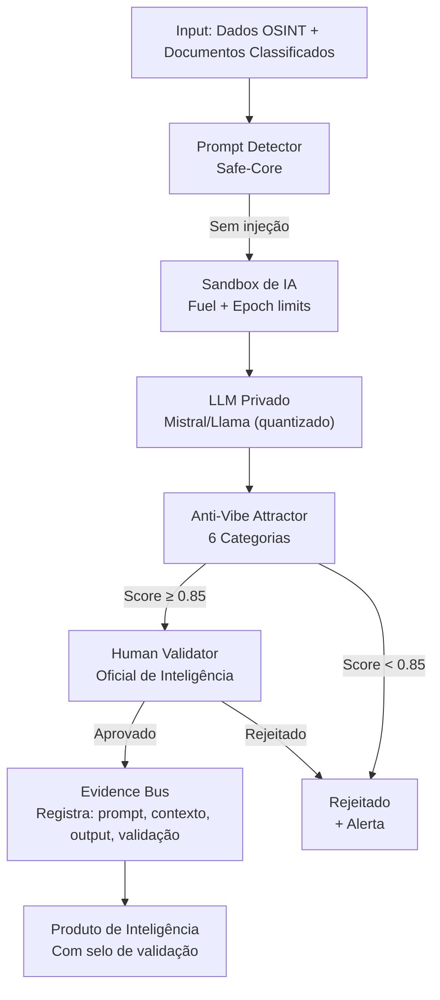

---

## 4. Integração Polyglot Verifier ↔ API Gateway + MAIA

### 4.1 Conceito Safe-Core
O **Polyglot Verifier** é um sistema de análise estática multi-linguagem que detecta vulnerabilidades de segurança, violações de convenções (Convention X), e pacotes maliciosos (anti-slopsquatting). Usa tree-sitter para parsing e queries semânticas.

### 4.2 Adaptação para SISBIN

| Caso de Uso | Linguagem / Stack | Verificação Polyglot |
|-------------|-------------------|----------------------|
| **Integrações no API Gateway** (código de conectores de órgãos federados) | Rust, Go, Python | convention_x (unwrap proibido, unsafe auditado); security (SQL injection, path traversal); dependency (anti-slopsquatting de crates/pacotes) |
| **Pipelines de IA** (MAIA-SISBIN) | Python (PyTorch, transformers), Rust (Candle) | security (pickle deserialization, model serialization attacks); dependency (verificação de hashes de modelos baixados do HuggingFace) |
| **libharpia / CEPESC** | C, Rust, Assembly | security (buffer overflow, side-channel); convention_x (comentários de segurança obrigatórios); formal verification (Kani para Rust) |
| **Configuração de Infraestrutura** (NSI) | Terraform, Ansible, YAML | security (secrets hardcoded, IAM overprivileged); convention_x (state locking, backup verification) |

### 4.3 CI/CD com Polyglot Verifier

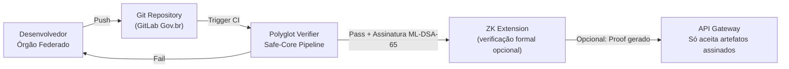

> **Regra de ouro:** Nenhum artefato de código (conector, modelo, configuração) é aceito no API Gateway sem passar pelo Polyglot Verifier e ser assinado com ML-DSA-65 via PCPv2.

---

## 5. Matriz de Conformidade SISBIN × Safe-Core

| Requisito SISBIN (Decreto 11.693/2023 + PTD) | Pattern Safe-Core | Status de Integração |
|-----------------------------------------------|-------------------|----------------------|
| Rastreabilidade e auditabilidade dos fluxos (Art. 10, XI) | Evidence Bus | ✅ Integrado ao Data Lineage |
| Segurança das comunicações e cibernética | Polyglot Verifier + SHB Benchmark | ✅ CI/CD obrigatório |
| Inteligência artificial (capacidade do PTD) | Anti-Vibe Attractor | ✅ Pipeline MAIA-SISBIN |
| Governança de dados | Evidence Bus + OPA ABAC | ✅ Catálogo federado |
| Interoperabilidade | Polyglot Verifier (API contracts) | ✅ Gateway + OpenAPI 3.0 |
| Visibilidade para controle externo (CCAI) | Evidence Bus → Merkle Root | ✅ Auditoria CCAI |

---

# PARTE III — Análise de Risco: Concentração Serpro + Mitigação Multi-Cloud Soberano

## 1. Panorama Atual da Nuvem de Governo

> **Fatos verificados (2025–2026):**
> - A Nuvem de Governo foi lançada em junho de 2025, operada conjuntamente por **Serpro** e **Dataprev**.
> - Mais de **250 órgãos** do Executivo Federal já têm acesso aos serviços.
> - Investimento conjunto supera **R$ 1 bilhão**.
> - Serpro e Dataprev foram **retiradas do Plano Nacional de Desestatização** em 2023, reconhecidas como estratégicas.
> - Modelo: equipamentos de **AWS, Google, Huawei e Oracle** instalados fisicamente em datacenters brasileiros, sob gestão 100% estatal.
> - Dataprev opera em **ambiente multinuvem** e realiza **testes de desconexão** de big techs.

### 1.1 Topologia Atual

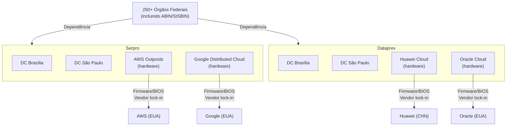

---

## 2. Análise de Risco — Concentração Serpro/Dataprev

### 2.1 Matriz de Riscos

| ID | Risco | Probabilidade | Impacto | Severidade | Vetor |
|----|-------|--------------|---------|------------|-------|
| **R1** | **Single Point of Failure operacional** — falha simultânea ou ransomware que atinja ambos os datacenters (compartilham ecossistema de fornecedores, pessoal, e jurisdição) | Média | Catastrófico | **Crítico** | Ransomware cross-tenant; falha de supply chain elétrica/rede em Brasília; insider com acesso a ambos |
| **R2** | **Vendor lock-in de firmware** — AWS Outposts, Google Distributed Cloud, Huawei, Oracle: firmware proprietário, atualizações remotas controladas pelo vendor, backdoors potenciais | Alta | Alto | **Crítico** | Supply chain compromise; compelled access (CLOUD Act EUA para AWS/Google/Oracle); backdoor de estado chinês em Huawei |
| **R3** | **Concentração de talento e processos** — Serpro e Dataprev competem pelo mesmo pool de engenheiros de nuvem no DF; turnover crítico paralisa operações | Alta | Alto | **Alto** | Turnkey de equipes críticas; salários não competitivos vs. mercado privado; burnout em incidentes |
| **R4** | **Conflito de interesses institucionais** — Serpro também opera sistemas não-classificados (gov.br, IRPF, CNH digital); mesma infraestrutura física para dados ultrassecretos e dados cidadãos cria risco de cross-contamination | Média | Alto | **Alto** | Misconfiguration; VLAN hopping; hypervisor escape; insider com acesso a múltiplos tenants |
| **R5** | **Geopolítica e extraterritorialidade** — Embora dados estejam em solo BR, vendors EUA (AWS, Google, Oracle) estão sujeitos ao CLOUD Act; Huawei está sob sanções e escrutínio de alianças ocidentais; nenhum vendor é 100% neutro | Alta | Alto | **Alto** | Ordem judicial extraterritorial; embargo tecnológico; revogação de licença de firmware |
| **R6** | **Escassez de alternativas** — Se Serpro/Dataprev falharem, não há provedor soberano de prontidão para assumir 250+ órgãos; dependência de migração lenta e complexa | Média | Catastrófico | **Crítico** | Não há provedor "B" pronto; contratos de longo prazo; acoplamento arquitetural |
| **R7** | **Concentração de risco cibernético** — Ataque coordenado contra Serpro e Dataprev (ambos em Brasília/SP) afeta todo o governo federal de uma só vez; não há segmentação geográfica real | Média | Catastrófico | **Crítico** | Ataque DDoS massivo; ataque físico (drone, sabotagem); ciberataque APT contra hipervisor |

### 2.2 Análise Causal (Ishikawa)

```
Concentração de Risco
├── PESSOAS: Mesmo pool de talento; turnover; cultura de sigilo excessivo
├── PROCESSOS: Mesmos procedimentos de patch; mesmas janelas de manutenção
├── TECNOLOGIA: Mesmos vendors de hardware (AWS/Google/Huawei/Oracle); mesmo stack VMware
├── FÍSICO: Datacenters em Brasília e SP apenas; mesma matriz elétrica/região sísmica
├── INSTITUCIONAL: Duas estatais, mas mesmo acionista (União); mesma supervisão (MGI)
└── GEOPOLÍTICO: Vendors estrangeiros com leis extraterritoriais; sanções; embargos
```

---

## 3. Proposta de Mitigação: Arquitetura Multi-Cloud Soberano Resiliente (AMSR)

### 3.1 Princípios Fundamentais

1. **Soberania operacional absoluta** — Gestão 100% estatal, mas distribuída entre múltiplos operadores soberanos.
2. **Diversidade de vendors** — Nenhum vendor estrangeiro >30% da capacidade total; presença de vendors nacionais/alternativos.
3. **Resiliência geográfica** — Mínimo 4 regiões, em 3 macrorregiões brasileiras (Norte, Nordeste, Sul/Sudeste).
4. **Failover ativo-ativo** — RPO=0 para dados não-classificados; RPO<1min para restrito; RPO<5min para crítico.
5. **Crypto-agnostic zone** — Cada zona opera com criptografia CEPESC independente; chaves nunca saem do HSM local.

### 3.2 Topologia Proposta

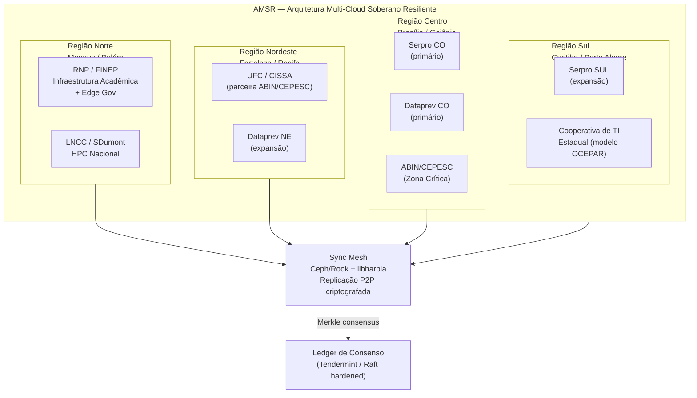

### 3.3 Operadores Soberanos Diversificados

| Operador | Região | Papel | Tecnologia Base | Status |
|----------|--------|-------|----------------|--------|
| **Serpro** | CO + SUL | Primário; sistemas estruturantes; gov.br | VMware + AWS Outposts + Google DC | ✅ Operacional |
| **Dataprev** | CO + NE | Primário; dados previdenciários; IND | Multi-cloud (Huawei + Oracle + AWS) | ✅ Operacional |
| **RNP** | Norte + NE | Acadêmico; HPC; pesquisa sensível; backup | OpenStack + Kubernetes nativo | 🔄 Escalável |
| **UFC/CISSA** | NE | Pesquisa PQC; parceria CEPESC; edge | Bare metal + libharpia | ✅ Parceria ativa |
| **LNCC/SDumont** | RJ (Sudeste) | HPC; simulações cripto; análise de grandes volumes | Slurm + Lustre + Ceph | ✅ Operacional |
| **Cooperativas Estaduais** | Sul | Modelo OCEPAR; TI dos estados; redundância | Heterogêneo (estado a estado) | 📝 Proposta |

### 3.4 Estratégia de Redução de Dependência de Vendors Estrangeiros

| Vendor Atual | Risco | Mitigação | Timeline |
|--------------|-------|-----------|----------|
| **AWS** (Outposts) | CLOUD Act; dependência de firmware | Migrar workloads não-classificados para RNP OpenStack; manter AWS apenas para burst capacity | 2027–2028 |
| **Google** (Distributed Cloud) | CLOUD Act; AI/ML lock-in | Substituir por stack open (Kubernetes + Kubeflow + Candle/Rust) no LNCC; manter Google para serviços cidadãos | 2027–2028 |
| **Huawei** | Sanções ocidentais; espionagem de estado | Isolar em zona não-classificada; não usar para dados sigilosos; plano de saída para RNP/Dataprev | 2026–2027 |
| **Oracle** | CLOUD Act; database lock-in | Migrar bancos críticos para PostgreSQL + CockroachDB; manter Oracle para sistemas legados | 2027–2029 |
| **VMware** (Serpro Cloud One) | Broadcom aquisição; licenciamento predatório | Migrar para Proxmox / oVirt / OpenStack na RNP e cooperativas | 2026–2028 |

### 3.5 Modelo de Governança Multi-Cloud

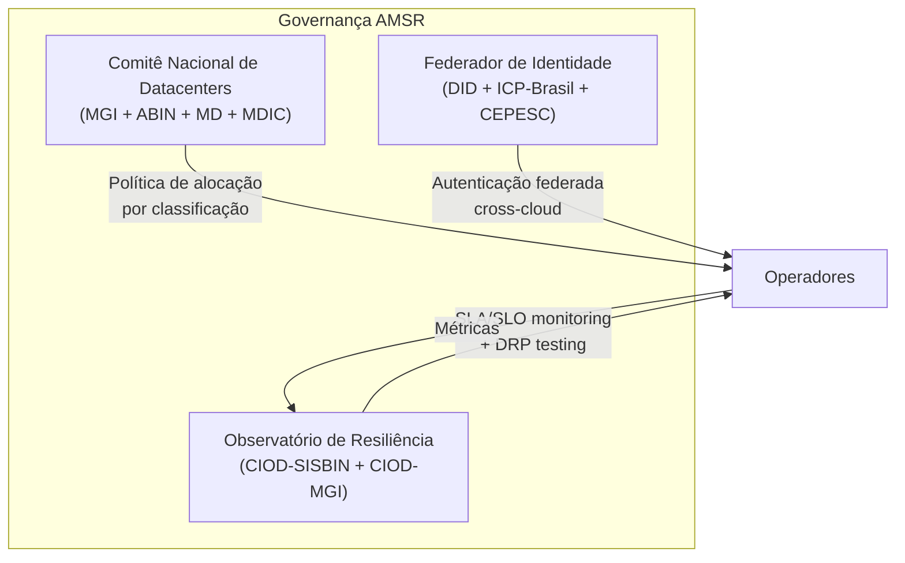

| Função | Entidade | Responsabilidade |
|--------|----------|----------------|
| **Política de Alocação** | Comitê Nacional (MGI + ABIN) | Define quais dados vão para qual operador/região com base em classificação, câmara temática, e geopolítica |
| **Federador de Identidade** | CEPESC/ABIN + gov.br | DID cross-cloud; capability tokens; rotação de chaves PQC; revogação em tempo real |
| **Observatório de Resiliência** | CIOD-SISBIN | Monitoramento 24/7 de todos os operadores; DRP testing trimestral; simulações de failover; métricas de MTTR/MTBF |
| **Auditoria de Vendors** | CCAI + CGU | Auditoria anual de firmware; verificação de backdoors; análise de compliance com CLOUD Act/sanções |
| **Contingência de Saída** | Comitê Nacional | Playbooks de migração de emergência; escrow de dados criptografados; contratos com cláusulas de reversibilidade |

---

## 4. Roadmap de Implementação AMSR

| Fase | Período | Entregas | Investimento Estimado |
|------|---------|----------|----------------------|
| **Fase 1 — Diversificação** | 2026 Q3–Q4 | • Expansão Dataprev para NE (Fortaleza)<br/>• Ativação RNP como operador secundário (Norte)<br/>• Testes de failover Serpro ↔ RNP<br/>• Auditoria de firmware AWS/Google/Huawei/Oracle | R$ 150M |
| **Fase 2 — Desacoplamento** | 2027 Q1–Q2 | • Migração 30% workloads não-classificados para RNP<br/>• Zona crítica ABIN/CEPESC isolada em datacenter próprio (air-gap)<br/>• Implementação Sync Mesh (Ceph P2P criptografado)<br/>• Cooperativa estadual piloto (Paraná/OCEPAR) | R$ 300M |
| **Fase 3 — Resiliência Total** | 2027 Q3–Q4 | • Failover ativo-ativo 4 regiões<br/>• Vendor estrangeiro nenhum >25% da carga<br/>• Ledger de consenso operacional<br/>• Exercício DRP governamental (simulação de ataque a 2 datacenters) | R$ 250M |
| **Fase 4 — Soberania Plena** | 2028 | • Stack 100% open-source para zonas públicas e restritas<br/>• libharpia como padrão criptográfico em todos os operadores<br/>• Certificação internacional de soberania digital (modelo Gaia-X brasileiro) | R$ 200M |

> **Investimento total estimado:** R$ 900M (complementar aos R$ 1 bi já investidos em Serpro/Dataprev).

---

## 5. Considerações Finais

### 5.1 Síntese das Três Entregas

| Entrega | Score de Viabilidade | Principal Risco Residual |
|---------|---------------------|-------------------------|
| **PDF-SISBIN** (Parte I) | 78/100 | Complexidade do ABAC cross-órgão; resistência institucional de órgãos permanentes |
| **Integração Safe-Core** (Parte II) | 72/100 | Maturidade do Safe-Core (projetos ainda em desenvolvimento); curva de aprendizado de órgãos federados |
| **AMSR Multi-Cloud** (Parte III) | 68/100 | Orçamento adicional de R$ 900M; coordenação interministerial; timeline geopolítica acelerada |

### 5.2 Recomendações Transversais

1. **Não reinventar o que já existe:** O gov.br, o ID.gov, a Nuvem de Governo, e o msg.gov são ativos reais. O PDF-SISBIN deve **integrar**, não substituir.
2. **CCAI como stakeholder de design:** A auditabilidade não pode ser retrofit. O Evidence Bus deve ser requisito desde o primeiro commit.
3. **IA como acelerador, não substituto:** O MAIA-SISBIN deve operar com **revisão humana obrigatória** para produtos estratégicos, conforme a Diretriz de IA em Inteligência proposta.
4. **Criptografia como fundação:** A libharpia e o PCPv2 são diferenciais soberanos brasileiros. Devem ser padronizados em toda a stack, não apenas na ABIN.
5. **Resiliência como prioridade de Estado:** A concentração Serpro/Dataprev é um risco sistêmico. A AMSR não é luxo — é **continuidade de governo**.

---

> **Documento gerado em:** 2026-08-12  
> **Baseado em:** Decreto 11.693/2023, Portaria 2.091/2024, PTD ABIN-MGI (mar/2024), Nuvem de Governo MGI (jun/2025), parceria CEPESC-CISSA (2025), Safe-Core/AGISAFE patterns.

