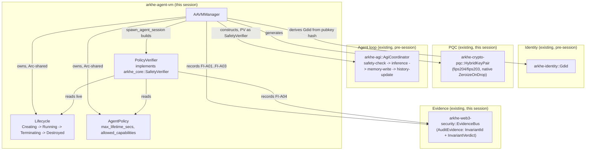
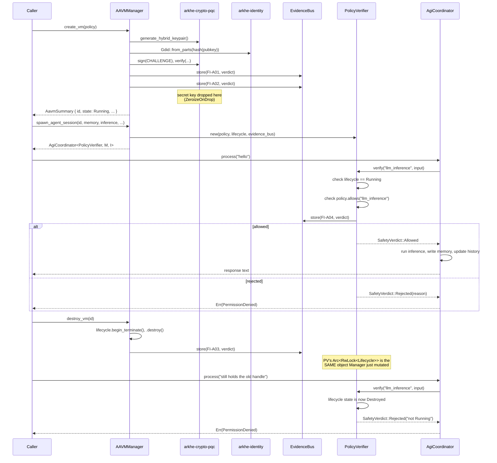

# AAVM integration: identity, lifecycle, policy, and agent execution

**Scope note:** this describes what `arkhe-agent-vm` actually does today —
not a target architecture. Where a prior document (a "Monorepo Completo"
spec) described AAVM concepts that don't exist yet (`arkhe-cuda-guard`,
`SectorLoop`/`SectorPolicy`, hardware-level `seccomp`/`landlock` execution,
self-modifying agent policies), they're intentionally absent here — see
"Explicitly out of scope" at the bottom for why each one isn't in this
diagram, and [ADR-0001](../decisions/ADR-0001-two-pqc-crates.md) for the
one architectural decision this crate has actually made so far.

## Component map

## Flow: `create_vm` → `spawn_agent_session` → `process` → `destroy_vm`

The last two rows are the part that's actually tested end-to-end (not just
diagrammed): `manager.rs::tests::destroying_the_vm_blocks_further_process_calls_on_an_already_spawned_session`
builds a real `AgiCoordinator` + `NullEngine`, calls `process()` once
successfully, destroys the VM, and asserts the *same* coordinator handle's
next `process()` call fails — proving the shared `Arc<RwLock<Lifecycle>>`
actually propagates the state change rather than each side holding its own
snapshot.

## Invariants recorded to `EvidenceBus`

| ID | Checked in | What it means | Formalized |
|---|---|---|---|
| FI-A01 | `create_vm` | The VM's secret key can sign a message its own public key verifies (self-attestation) | Not yet — Rust-only |
| FI-A02 | `create_vm` | `policy.max_lifetime_secs > 0` | Not yet — Rust-only |
| FI-A03 | `destroy_vm` | Lifecycle transitioned `Running -> Terminating -> Destroyed` without error | Overlaps with the general transition-graph approach in `arkhe-web3-security/proofs/lean/Web3Invariants/Reentrancy.lean`, not separately proven for this crate's specific graph |
| FI-A04 | `PolicyVerifier::verify` (every `process()` call) | Action allowed only if `policy.allows(action)` **and** `lifecycle == Running` | Yes — `crates/arkhe-agent-vm/proofs/lean/AgentVm/PolicyGate.lean`, **type-checked** (`lake build`, 5/5 jobs, see `docs/verification/lake-build-agent-vm-2026-07-11.txt`) |
| FI-A05 | `AAVMManager::snapshot` | A captured snapshot passes its own integrity check; a tampered one fails it (given hash injectivity) | Yes — `crates/arkhe-agent-vm/proofs/lean/AgentVm/SnapshotIntegrity.lean`, **type-checked**. Does not prove anything about BLAKE3 itself — see that file's doc comment |

FI-A06 is not listed: no definition of "RVM"/coherence domains was
available in this codebase or session context to formalize against.

## Explicitly out of scope (and why)

- **OS-level sandboxing / hardware execution / `seccomp`/`landlock`** — no
  process isolation, resource limiting, or syscall filtering exists
  anywhere in this workspace yet (`arkhe-tool-sandbox` has no source at
  all; `arkhe-syscall-bridge` is a mapping table with no enforcement).
  `PolicyVerifier` is in-process, type-system-level gating — it stops a
  disallowed `process()` call from starting, not what an allowed call can
  do once inference runs. Building real sandboxing is its own large,
  security-critical project, not an incremental addition to this one.
- **`SectorLoop` / `SectorPolicy`** — searched the whole
  `safe-core-monorepo` workspace for `SectorLoop`, `SectorPolicy`,
  `arkhe-sector`: zero matches. Nothing to integrate with yet.
- **Coherence domains / "RVM" / proof-gated re-partitioning** — no
  definition of "RVM" is available in this codebase or this session's
  context. Not attempted rather than guessed at.
- **Auto-evolution (agents mutating their own policy)** — a real, distinct
  design question (how much can an agent loosen its own constraints, and
  under what check) that deserves its own scoping conversation, not a
  same-pass addition alongside everything else here.
